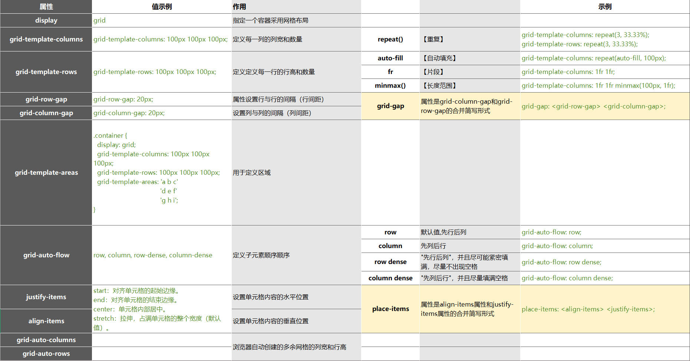
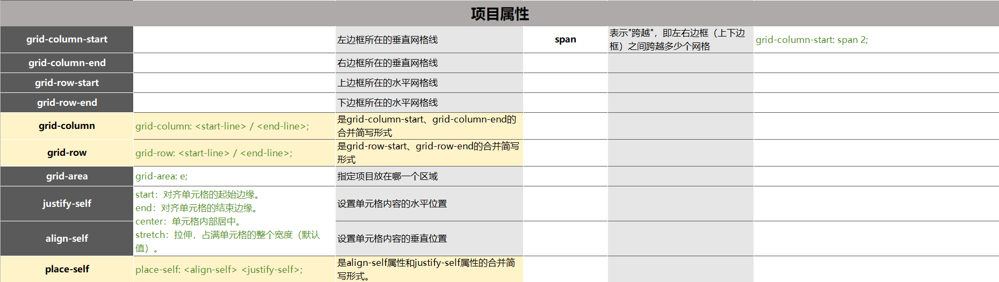
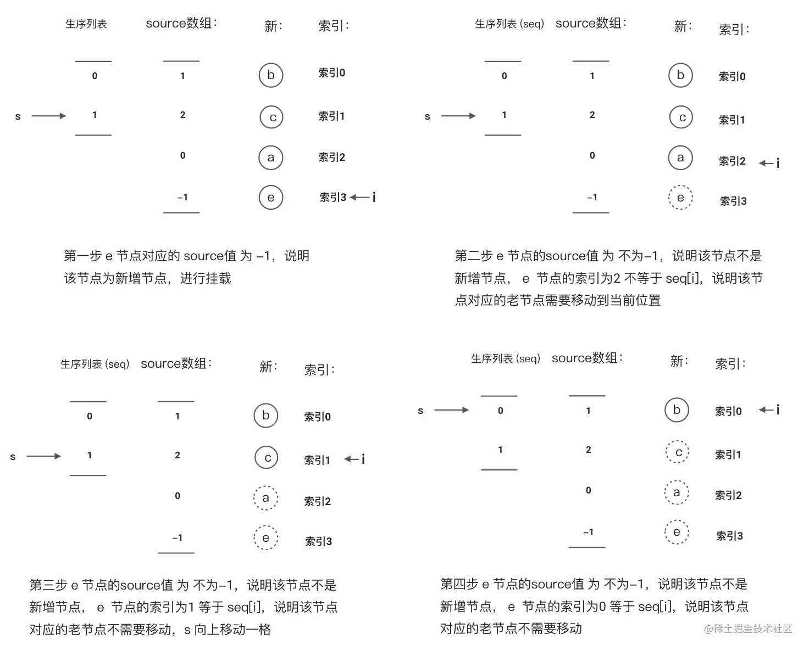
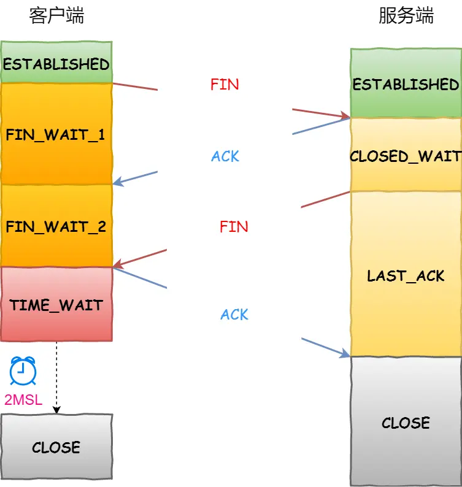
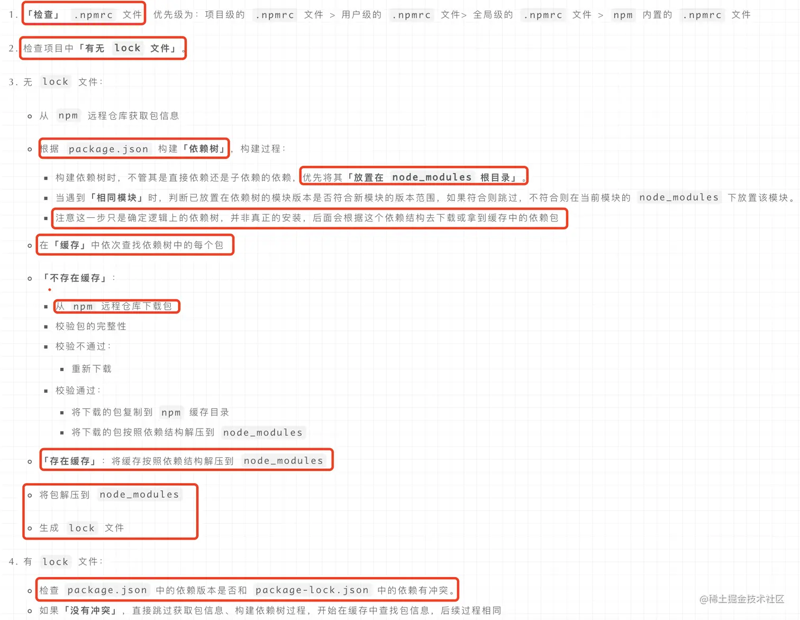

# HTML + CSS

1. - [讲一下盒模型，普通盒模型和怪异盒模型有什么区别？](https://juejin.cn/post/7220775341605339194)

2. [块元素和行内元素区别是什么？常见块元素和行内元素有哪些？](https://blog.csdn.net/m0_51273200/article/details/120336046)

3. - [HTML 语义化标签 有哪些？](https://juejin.cn/post/6844903544995184653)

4. [伪类和伪元素的区别是什么？](https://github.com/pro-collection/interview-question/issues/354)

5. - [CSS 如何实现垂直居中？](https://github.com/pro-collection/interview-question/issues/36)

6. [CSS 常见的选择器有哪些？](https://github.com/pro-collection/interview-question/issues/353)

7. CSS 的优先级如何计算？

8. [长度单位 px、em 和 rem 的区别是什么？](https://github.com/febobo/web-interview/blob/master/docs/css/em_px_rem_vh_vw.md)

9. [讲一下 flex 弹性盒布局？](https://github.com/pro-collection/interview-question/issues/100)

- 容器属性

  - flex-direction - 决定主轴的方向
    - row（默认值）：主轴为水平方向，起点在左端。
    - row-reverse：主轴为水平方向，起点在右端。
    - column：主轴为垂直方向，起点在上沿。
    - column-reverse：主轴为垂直方向，起点在下沿。
  - flex-wrap - 如何换行
    - nowrap（默认）：不换行，按正常的流动方向排列。
    - wrap：换行，按正常的流动方向排列。
    - wrap-reverse：换行，按相反的流动方向排列。
  - flex-flow
    - flex-direction 与 flex-wrap 简写形式，定义项目的排列方向,默认值为 row nowrap。
  - justify-content - 项目在主轴上的对齐方式。
    - flex-start（默认值）：左对齐
    - flex-end：右对齐
    - center：居中
    - space-between：两端对齐，项目之间的间隔都相等。
    - space-around：每个项目两侧的间隔相等。
  - align-items - 项目在交叉轴上如何对齐。
    - flex-start（默认值）：交叉轴的起点对齐。
    - flex-end：交叉轴的终点对齐。
    - center：交叉轴的中点对齐。
    - baseline：项目的基线对齐。
    - stretch（默认值）：如果项目未设置高度或设为 auto，将占满整个容器的高度。
  - align-content - 定义了多根轴线的对齐方式。如果项目只有一根轴线，该属性不起作用
    - flex-start（默认值）：与交叉轴的起点对齐。
    - flex-end：与交叉轴的终点对齐。
    - center：与交叉轴的中点对齐。
    - space-between：与交叉轴两端对齐，轴线之间的间隔平均分布。
    - space-around：每根轴线两侧的间隔都相等。

- 项目的属性

  - order
    - 定义项目的排列顺序。数值越小，排列越靠前，默认为 0。
  - flex-grow
    - 定义项目的放大比例，默认为 0，即如果存在剩余空间，也不放大。
  - flex-shrink
    - 定义了项目的缩小比例，默认为 1，即如果空间不足，该项目将缩小。
  - flex-basis
    - 定义了在分配多余空间之前，项目占据的主轴空间（main size）。浏览器根据这个属性，计算主轴是否有多余空间。它的默认值为 auto，即项目的本来大小。
    - 它可以设为跟 width 或 height 属性一样的值（比如 200px），则项目将占据固定空间。
    - 可以设为跟 width 或 height 属性一样的值（比如 350px），则项目将占据固定空间。
  - flex
    - 是 flex-grow, flex-shrink 和 flex-basis 的简写，默认值为 0 1 auto
  - align-self
    - align-self 属性允许单个项目有与其他项目不一样的对齐方式，可覆盖 align-items 属性。

10. [浮动塌陷问题解决方法是什么？](https://juejin.cn/post/7074581427571916807)

11. [position 属性的值有哪些？各个值是什么含义？](https://github.com/pro-collection/interview-question/issues/158)

12. [BFC、IFC 是什么？](https://juejin.cn/post/7072174649735381029)

BFC（Block Formatting Contexts）块级格式化上下文, 页面中的一块渲染区域，并且有一套渲染规则，它决定了其子元素将如何定位，以及和其他元素的关系和相互作用。

- 如何触发 BFC？
  - 根元素
  - 浮动 `float: left/right/inherit`
  - position 为 `absolute` 或 `fixed`
  - overflow 不为 `visible`
  - display 为 `inline-block`、`table-cell`、`table-caption` 或 `flex/inline-flex`等
- BFC 布局规则

  - 内部的 Box 垂直方向的排列顺序，与外部 Box 垂直方向的排列顺序相同。
  - Box 垂直方向的距离由 margin 决定。属于同一个 BFC 的两个相邻 Box 的 margin 会发生重叠。
  - 每个元素的 margin box 的左边， 与包含块 border box 的左边相接触(对于从左往右的格式化，否则相反)。即使存在浮动也是如此。
  - 计算 BFC 的高度时，浮动元素也参与计算。
  - BFC 的区域不会与 float 元素重叠。
  - BFC 就是页面上的一个隔离的独立容器，容器里面的子元素不会影响到外面的元素。反之也如此。

- 应用场景：
  - 解决块级元素垂直方向 margin 重叠
  - 解决高度塌陷问题
  - 清除浮动

IFC（Inline Formatting Contexts）内联格式化上下文，行内元素的格式化上下文。

- 如何触发 IFC？
  - 块级元素中仅包含内联级别元素
    - 形成条件非常简单，需要注意的是当 IFC 中有块级元素插入时，会产生两个匿名块将父元素分割开来，产生两个 IFC。
- IFC 布局规则
  - 内部元素按从左到右的顺序排列：IFC 中的内联元素会按从左到右的顺序排列，如果空间不够就会自动换行，因此我们永远不需要手动在行尾添加“换行符”。
  - 子元素只会计算横向样式空间，【padding、border、margin】，垂直方向样式空间不会被计算，【padding、border、margin】。
  - 对齐方式由父容器决定：IFC 内部元素的对齐方式受到父容器的控制。（`text-align`、`vertical-align`）
  - 能把在一行上的框都完全包含进去的一个矩形区域，被称为该行的行框（`line box`）,行框的宽度是由它的包含块（`containing box`）和与其中的浮动来决定。
  - IFC 中的 `line box` 一般左右边贴紧其包含块，但 float 元素会优先排列。
  - IFC 中的 `line box` 高度由 CSS 行高计算规则来确定，同个 IFC 下的多个 `line box` 高度可能会不同。
  - 当 `inline boxes` 的总宽度少于包含它们的 `line box` 时，其水平渲染规则由 text-align 属性值来决定。
  - 当一个 `inline box` 超过父元素的宽度时，它会被分割成多个 boxes，这些 boxes 分布在多个 `line box` 中。如果子元素未设置强制换行的情况下，`inline box` 将不可被分割，将会溢出父元素。
- 应用场景
  - 对于一些包含多个小的文字和图片的块，在需要进行对齐和布局的时候，可以使用 IFC 来控制它们的位置和对齐方式。
  - IFC 常用作文本的排版环境，例如在实现栏目列表、文章标题、文章正文等方面常用。
  - 在一些富文本编辑器开发中，我们可以使用 IFC 来控制编辑器中的文字格式，例如设置字号、字体、颜色等。
  - 水平居中：当一个块要在环境中水平居中时，设置其为 inline-block 则会在外层产生 IFC，通过设置父容器  text-align:center  则可以使其水平居中。
    - 值得注意的是，设置一个块为  inline-block ，以单个封闭块来参与外部的 IFC，而内部则生成了一个 BFC。

13. [多列等高布局](https://juejin.cn/post/7197614864364273722)

```
<div class="container">
  <div class="left">left</div>
  <div class="center">center</div>
  <div class="right">right</div>
</div>

.left {
  background-color: red;
}
.center {
  background-color: green;
}
.right {
  background-color: blue;
}

```

- padding + 负 margin
  ```
  .container {
    overflow: hidden;
  }
  .center,
  .left,
  .right {
    padding-bottom: 10000px;
    margin-bottom: -10000px;
  }
  ```
- 模仿 table 布局

  ```
  .container {
    display: table;
  }
  .center,
  .left,
  .right {
    display: table-cell;
  }
  ```

- flex 实现

  ```
  .container {
    display: flex;
  }
  ```

- grid 实现
  ```
  .container {
    display: grid;
    grid-auto-flow: column;
  }
  ```

14. [CSS Grid 布局](https://github.com/pro-collection/interview-question/issues/420)

- 容器属性
  

- 项目（item）属性
  

15. [清除浮动的解决方案](https://github.com/pro-collection/interview-question/issues/55)

16. [如何避免全局样式污染？](https://github.com/pro-collection/interview-question/issues/422)

- `使用命名约定-前缀`：给不同组件、模块或页面的样式类名添加特定的前缀，以确保它们的作用范围只在对应的组件、模块或页面内生效。
- `使用 CSS-in-JS`：使用 CSS-in-JS 技术，将样式直接与组件绑定，可以避免全局样式的冲突。常见的 CSS-in-JS 工具库有 [`styled-components`](https://juejin.cn/post/7088876240404217886)、[`Emotion`](https://juejin.cn/post/7135445302957309965)等。
- `使用 CSS Modules`：CSS Modules 是一种 CSS 模块化的解决方案，它通过将 CSS 文件与组件绑定，在构建过程中自动生成唯一的类名，从而实现样式的局部作用域。这样可以避免全局样式冲突。常见的 CSS Modules 实现包括 webpack 的 [`css-loader`]() 和 vue-style-loader。
- `使用作用域限定符`：使用 CSS 预处理器（如 Sass 或 Less）的作用域限定符（如父选择器 `&`）来限制样式的作用范围。
- `使用样式重置/规范`：使用样式重置或规范库，如 Normalize.css，可以消除浏览器默认样式的差异，以确保在不同浏览器下呈现一致的样式，并避免全局样式污染。
- `使用模块化开发框架`：使用诸如 React、Vue 或 Angular 等模块化开发框架，它们提供了组件化的开发模式，每个组件具有独立的样式作用域，可以避免全局样式的冲突。

17. [CSS Module 是什么？](https://github.com/pro-collection/interview-question/issues/589) --- [补充](https://juejin.cn/post/7215509220749213752)

`CSS Modules` 是一种 `CSS 模块化`的解决方案，它通过在编译时为每个 CSS 类名生成`唯一的标识符`，并将它们作为 JavaScript 对象的属性导出。这样，可以确保每个类名在整个应用程序中的唯一性，避免样式冲突。

使用 CSS Modules，可以将 `CSS 文件与组件文件绑定在一起`，这样每个组件都有自己的 CSS 作用域，样式只会应用于特定的组件，不会影响其他组件。这种隔离性和局部作用域有助于降低样式冲突和维护 CSS 的复杂性。

- 解决问题
  - 命名冲突和全局样式污染问题
  - 解决 css 选择器嵌套过深问题
  - 样式模块化

18. [Vue：Scoped Styles 和 CSS Modules 的区别](https://juejin.cn/post/7237324970556932153)

- Scoped Styles 是 Vue 独有的基于额外添加的 HTML attribute 实现的、类 shadow DOM 方案，更容易使用；

  - 只需要在 `<style>` 标签中添加一个 scoped 属性,下面代码会经过 `PostCSS` 处理并转换成如下代码:

    ```
    <template>
      <button class="button" />
      </template>
    <style scoped>
      .button {
        color: red;
      }
    </style>

    // 转换后
    <style>
    .button[data-v-f61kqi1] {
      color: red;
    }
    </style>

    <button class="button" data-v-f61kqi1></button>
    ```

  -

- CSS Modules 则最早由 React 社区采用，使用 JavaScript 语言管理页面中的样式

  - 使用模块 module 来代替 scoped 属性，这会告诉 vue-template-compiler 和 vue-cli 的 webpack 配置使用适当的加载器来处理此部分样式并生成以下 CSS：

  ```
  <template>
    <button :class="$style.button" />
  </template>

  <style module>
    .button {
      color: red
    }
  </style>

  // 转换后
  <style>
    .ComponentName__button__2Kxy {
      color: red;
    }
  </style>

  <button class=”ComponentName__button__2Kxy”></button>
  ```

19. [`Window.onLoad` 和 `DOMContentLoaded` 事件的先后顺序](https://juejin.cn/post/6862340770365210631)

20. [PostCSS](https://github.com/pro-collection/interview-question/issues/418) ----- [相关插件](https://juejin.cn/post/6862371071115558926#heading-4)

- `Autoprefixer` - 为 CSS 规则添加特定厂商的前缀
- `postcss-preset-env` - 将最新的 CSS 语法转换成大多数浏览器都能理解的语法，默认包含 `Autoprefixer` 插件
- `cssnano` - 通过移除注释、空白、重复规则、过时的浏览器前缀以及做出其他的优化压缩 CSS 代码
- `postcss-px-to-viewport` - 将 px 转为 rem
- `postcss-import` - 导入其他 CSS 文件
- `postcss-nested` - 允许使用嵌套的 CSS
- `postcss-modules` - 可以将样式文件转换为 CSS Modules 格式

# JavaScript

1. [谈谈对原型链的理解。](https://github.com/pro-collection/interview-question/issues/32)

2. [js 如何实现继承？](https://github.com/pro-collection/interview-question/issues/31)

3. js 有哪些数据类型？

4. js 有哪些判断类型的方法？

5. [如何判断一个变量是否数组？](https://github.com/pro-collection/interview-question/issues/431)

6. [Null 和 undefined 的区别？](https://github.com/pro-collection/interview-question/issues/111)

7. [call bind apply 的区别？](https://github.com/pro-collection/interview-question/issues/9) / [手写实现 call、apply、bind](https://github.com/pro-collection/interview-question/issues/84)

8. 防抖节流的概念？实现防抖和节流。[节流](https://github.com/pro-collection/interview-question/issues/53) / [防抖](https://github.com/pro-collection/interview-question/issues/51)

- 节流
  - 对于持续触发的事件，规定一个间隔时间（n 秒），每隔一段只能执行一次。
- 防抖
  - 函数防抖是指对于在事件被触发 n 秒后再执行的回调，如果在这 n 秒内又重新被触发，则重新开始计时

9. [深拷贝、浅拷贝的区别？如何实现深拷贝和浅拷贝？](https://github.com/febobo/web-interview/blob/master/docs/JavaScript/copy.md)

10. [对比 一下 var、const、let。](https://blog.csdn.net/xiewenhui111/article/details/113133330)

11. ES next 新特性有哪些？

12. [箭头函数和普通函数区别是什么？](https://github.com/pro-collection/interview-question/issues/103)

- 语法不同：箭头函数使用箭头 => 来定义函数，而普通函数使用 function 关键字来定义函数。

- 箭头函数没有自己的 this，会捕获其所在上下文的 this，作为自己的 this。而普通函数的 this 则由函数调用时的上下文所决定，可以通过 call、apply、bind 方法来改变。

- 箭头函数没有自己的 arguments 对象，它可以通过 rest 参数语法来接收不定数量的参数。而普通函数则有自己的 arguments 对象，它可以接收任意数量的参数。

- 箭头函数不能作为构造函数使用，不能使用 new 来实例化，因为它没有自己的 this，而普通函数可以用 new 来创建新的对象。

- 箭头函数不能使用 yield 关键字来定义生成器函数，而普通函数可以。

- 使用 call(),apply(),bind()并不会改变箭头函数中的 this 指向。

- 箭头函数没有 prototype 属性

- 原型函数不能定义成箭头函数

```
function Person(name){
  this.name = name
}

// 原型函数使用箭头函数，其中的this指向全局对象，而不会指向构造函数
// 因此访问不到构造函数本身，也就访问不到实例属性
Person.prototype.say = ()=>{console.log(this.name)}
```

13. 使用 new 创建对象的过程是什么样的？

14. [this 指向系列问题。](https://github.com/pro-collection/interview-question/issues/519) / [哪些原因会导致 js 里 this 指向混乱?](https://github.com/pro-collection/interview-question/issues/388) -- [111](https://juejin.cn/post/6944707409596121102) --- [222](https://juejin.cn/post/7041055543984652319)

- 类中的 this 总是指向调用它的对象
- 构造函数中的 this 是指向实例的对象，而普通函数的 this 是指向 window。

- 箭头函数的 this 总是指向外层非箭头函数的作用域的 this 指向 一层层向上找【箭头函数的外层如果有普通函数，那么箭头函数的 this 就是这个外层的普通函数的 this，箭头函数的外层如果没有普通函数，那么箭头函数的 this 就是全局变量。】

  ```
  let obj = {
    fn:function(){
        console.log('我是普通函数',this === obj)   // true
        return ()=>{
            console.log('我是箭头函数',this === obj) // true
        }
    }
  }
  console.log(obj.fn()())

  // *************

  let obj = {
      fn:()=>{
          console.log(this === window); // true
      }
  }
  console.log(obj.fn())
  ```

  ```
  obj.test = ()=>{
    console.log(this)  // this向外层找就是window
  }

  ```

  ```
  obj.test1 = function(){
    var t = ()=>{
      console.log(this)  // this向外层找就是function(){} 所以指向 obj
    }
    t()
  }
  ```

  ```
  obj.test2 = function(){
    setTimeout(function(){
      console.log(this)  // this在function(){} 里所以不需要往外层去找，但是定时器函数中的this指向的是window
    },100)
  }
  ```

---

该箭头函数的 this 向外层找就是函数 t1,函数 t1 没有任何的指向,所以指向 window。

```
obj.test4 = function(){
  console.log(this)  // obj
  var t1 = function(){
  console.log(this) // window
    var t2 = ()=>{
      console.log(this) // window
    }
    t2()
  }
  t1()
}
```

function t(){}没有任何指向,所以指向 window,test3 被 obj2 引用所以指向 obj2

```
var obj2 = {
  a:1,
  test3:function(){
    console.log(this)  // obj2
    function t(){
      console.log(this)  // window
    }
    t()
  }
}
```

15. [谈谈对闭包的理解？什么是闭包？闭包有哪些应用场景？闭包有什么缺点？如何避免闭包？](https://github.com/pro-collection/interview-question/issues/37)

    1. 不使用 prototype 属性定义的对象方法，是静态方法，只能直接用类名进行调用！另外，此静态方法中无法使用 this 变量来调用对象其他的属性！
    2. 使用 prototype 属性定义的对象方法，是非静态方法，只有在实例化后才能使用！其方法内部可以 this 来引用对象自身中的其他属性！
    3. 闭包的实现原理，其实是利用了作用域链的特性
    4. 作用
       - 匿名自执行函数
       - 结果缓存
       - 封装
       - 实现类和继承
    5. 缺点
       - 由于闭包会使得函数中的变量都被保存在内存中，内存消耗很大，所以不能滥用闭包，否则会造成网页的性能问题，在 IE 中可能导致内存泄露。解决方法是，在退出函数之前，将不使用的局部变量全部删除。
       - 闭包会在父函数外部，改变父函数内部变量的值。所以，如果你把父函数当作对象（object）使用，把闭包当作它的公用方法（Public Method），把内部变量当作它的私有属性（private value），这时一定要小心，不要随便改变父函数内部变量的值。

1. [谈谈对 js 事件循环的理解？](https://github.com/pro-collection/interview-question/issues/142)

1. [谈谈对 promise 理解？](https://github.com/febobo/web-interview/blob/master/docs/es6/promise.md)

1. [手写 Promise。](https://github.com/pro-collection/interview-question/issues/57)

1. [实现 Promise.all 方法。](https://github.com/pro-collection/interview-question/issues/107)

1. [Typescript 中 type 和 interface 的区别是什么？](https://github.com/pro-collection/interview-question/issues/273)

1. [讲讲 Typescript 中的泛型？](https://github.com/febobo/web-interview/blob/master/docs/typescript/generic.md)

1. [Typescript 如何实现一个函数的重载？](https://juejin.cn/post/7201883287938007096)

当我们多次调用函数时传递不同参数数量或者类型，函数会做出不同处理。
**「函数签名」**，顾名思义，函数签名主要定义了参数及参数类型，返回值及返回值类型。函数签名不同，函数会做出不同的处理，这是我对函数重载的理解。

- 构造器重载
- 联合类型函数重载
- JS 中函数重载
  - 利用 arguments 参数
  - 利用闭包和 arguments

1. [CmmonJS 和 ESM 区别？](https://segmentfault.com/a/1190000043720379)

1. [柯里化是什么？有什么用？怎么实现？](https://github.com/pro-collection/interview-question/issues/361)

1. [讲讲 js 垃圾回收机制。](https://github.com/pro-collection/interview-question/issues/118)

1. 实现一个发布订阅。

1. [如何实现数组扁平化？](https://juejin.cn/post/7024337692108259365)

1. 如何实现数组去重？

1. [如何将 JavaScript 代码解析成抽象语法树(AST)](https://github.com/pro-collection/interview-question/issues/357)

[axios 是如何区分是 nodejs 环境还是 浏览器环境 的](https://github.com/pro-collection/interview-question/issues/574)

---

# Vue

[Redux 和 Vuex 的设计思想是什么](https://github.com/pro-collection/interview-question/issues/201)

[v-for 和 v-if 同时使用有问题吗？](https://github.com/pro-collection/interview-question/issues/579)

[组件通信](https://github.com/pro-collection/interview-question/issues/514)

[Vue 组件间通信方式有哪些？](https://github.com/febobo/web-interview/blob/master/docs/vue/communication.md)

[为什么 vue 中的 data 要用 return 返回](https://juejin.cn/post/7293401255052967973)

---

[响应式为何要从 Object.defineProperty 改为 proxy](https://github.com/pro-collection/interview-question/issues/595) ---- [补充](https://juejin.cn/post/6998165868332990471)

> 发布订阅模式： 订阅者向事件调度中心（PubSub）注册（subscribe）监听，当事件调度中心（PubSub）发布通知时（publish），订阅者的监听事件将会被触发。
> 观察者模式： 定义了对象之间 一对多 的依赖关系，它只有两个角色，分别是观察的目标对象 Subject 和观察者对象 Observer，当一个 目标对象 的状态发生改变时，所有依赖于它的 观察者对象 都会收到通知。

**整体简单的说就是，使用发布订阅模式中的特殊的一种 ---- `观察者模式`，被观察者也就是目标（数据对象），观察者（Watcher）其实就是包含组件重新渲染的 `渲染 Watcher`，用来更新 View。**

**首先通过 `Object.defineProperty()` 来劫持各个属性的 `setter`，`getter`，为每一个对象属性都添加的 `get` 与 `set` 方法, 并且在每个属性的 `get()` 中 `new` 了一个 `dep` 收集当前的 `渲染 Watcher`（因为这个属性值可能会被多个 View 绑定）,在 `set` 方法里通知每个观察者 `渲染 Watcher` 执行 `update` 方法【`Vue 在 new 渲染 Watcher的时候会将组件挂载更新的方法(updateComponent)传入，存储在渲染watcher中。触发渲染watcher的update方法时实际上是触发这个组件挂载更新方法, 也就是在属性被修改时触发了set方法，而这个set方法会将依赖当前属性的页面重新渲染，从而达到数据驱动的效果。`】**

实现 mvvm 的双向绑定，是采用数据劫持结合发布者-订阅者模式的方式，通过 Object.defineProperty()来劫持各个属性的 setter，getter，在数据变动时发布消息给订阅者，触发相应的监听回调。就必须要实现以下几点：(通过 getter 来收集视图中的依赖，在 setter 的时候更新视图)

1. 实现一个数据监听器 Observer，能够对数据对象的所有属性进行监听，如有变动可拿到最新值并通知订阅者

- **在 get 中 new 了一个 dep 收集当前的渲染 Watcher**
- **在 set 方法中遍历收集的渲染 Watcher 执行 update 方法**

2. 实现一个指令解析器 Compile，对每个元素节点的指令进行扫描和解析，根据指令模板替换数据，以及绑定相应的更新函数
3. 实现一个 Watcher，作为连接 Observer 和 Compile 的桥梁，能够订阅并收到每个属性变动的通知，执行指令绑定的相应回调函数，从而更新视图
   **_Vue 在 new 渲染 Watcher 的时候会将组件挂载更新的方法(updateComponent)传入，存储在渲染 watcher 中。触发渲染 watcher 的 update 方法时实际上是触发这个组件挂载更新方法, 也就是在属性被修改时触发了 set 方法，而这个 set 方法会将依赖当前属性的页面重新渲染，从而达到数据驱动的效果。_**

---

[Vue.nextTick 的实现？](https://github.com/pro-collection/interview-question/issues/124)

[computed 和 watch 区别是什么？](https://github.com/pro-collection/interview-question/issues/277)

[动态给 data 添加一个新的属性时会发生什么](https://github.com/pro-collection/interview-question/issues/571)

[说说 Vue 的 keep-alive 使用及原理。](https://github.com/pro-collection/interview-question/issues/119)

[使用 虚拟 DOM 一定会比直接操作 真实 DOM 快吗?](https://github.com/pro-collection/interview-question/issues/207)

讲讲[前端路由原理](https://github.com/pro-collection/interview-question/issues/269)。比较一下 history 和 hash 这两种路由。

[使用 history 模式的前端路由时静态资源服务器配置详解](https://juejin.cn/post/7204307381689532474#heading-119)

[讲讲 Vue 的虚拟 DOM，原理，好处是什么？](https://github.com/febobo/web-interview/issues/23)

## Vue2

[讲讲 Vue2 双向绑定原理。](https://blog.csdn.net/qq_43574741/article/details/119326529)

[生命周期](https://blog.51cto.com/u_16171599/6561182)

## Vue3

[生命周期](https://juejin.cn/post/7233661232556343357)

[讲讲 Vue3 双向绑定原理。](https://blog.csdn.net/qq_43574741/article/details/119326529)

[vue3 性能提升主要是体现在哪些方面](https://github.com/pro-collection/interview-question/issues/395)

mvvm 和 mvc 区别是什么？

---

## 2 & 3

[vu2 和 vue3 有什么区别？](https://github.com/febobo/web-interview/blob/master/docs/vue/vue3_vue2.md) --------- [补充](https://github.com/pro-collection/interview-question/issues/488)

[vu2 vu3 diff](https://juejin.cn/post/7092068900589797413) ---- [vu2 补充](https://juejin.cn/post/7211132346255638584) ----- [vu3 补充](https://juejin.cn/post/7286787235361882124?searchId=20231105222321A9B67E2A1471707403F5)

面试的时候，区别如果只说文本类型打了标记(`静态标记`)，估计不会得到认可。

```

// 判断两个 vnode 的标签和 key 是否相同 如果相同 就可以认为是同一节点就地复用
function isSameVnode(oldVnode, newVnode) {
return oldVnode.tag === newVnode.tag && oldVnode.key === newVnode.key;
}

```

遍历结束条件：

```

while (oldStartIdx <= oldEndIdx && newStartIdx <= newEndIdx)

```

vue2、vue3 的 diff 算法实现差异主要体现在：`处理完首尾节点后，对剩余节点的处理方式`。

在 vue2 [`核心方法是 updateChildren`]中是通过循环遍历剩余旧节点列表建立一个 `{ key, index }` 的映射表，然后遍历新节点列表的剩余节点，根据新的节点 `key` 在旧映射表中寻找可复用的节点，然后打补丁并且移动到正确的位置。具体比对方式：

用新的开始节点的 key,去映射表中查找:

- `找到了对应的索引`，那么会通过 sameVNode 对两个节点进行对比：

  - 相同节点，调用 patchVnode 进行深层对比和 dom 更新，将对应的节点插入到 `oldStartIdex` 对应的节点之前；并且，并且原来的位置用 `undefined` 占位，避免数组塌陷 防止老节点移动走了之后破坏了初始的映射表位置

  - 不同节点，则调用 createElm 重新创建一个新的 dom 节点并将 新的 vnode 插入到对应的位置

- `没有找到对应的索引`，则直接 createElm 创建新的 dom 节点并将新的 vnode 插入到对应位置(也就是 `oldStartIdex` 对应的节点之前)

最后，会将 `新节点数组的 起始索引 向后移动。`

剩余节点处理：
)

---

而在 vue3 [`核心方法是 patchKeyedChildren`]中是建立一个存储新节点数组中的剩余节点在旧节点数组上的索引的映射关系数组,
(`k 表示当前老节点在新集合中的位置，pos 表示上一个老节点在新集合里面的位置，默认是 0,如果 k < pos,说明不是升序需要移动, 否则 pos = k`)

建立完成这个数组后也即找到了可复用的节点，然后通过这个数组计算得到最长递增子序列，这个序列中的节点保持不动，然后将新节点数组中的剩余节点移动到正确的位置。

- 构造一个数组 source，它的长度为`剩余新的一组子节点`的长度，并且 source 中每个元素的初始值都是 `-1`,source 数组将用来存储 `新的一组子节点中的每个节点在旧的一组子节点中的位置索引`【这一步要经历两次循环：】

  - 第一个 for 循环便利`新节点集合`用来构建索引表 `{ key, index }`，[节点的 key 值与节点在 `新的一组子节点`中位置索引之间的映射]
  - 第二个 for 循环遍历 `旧的一组子节点`。拿旧子节点的 `key` 值去上一步得到的索引表 `{ key, index }` 中查找该节点在`新的一组子节点`中的位置，并将查找结果存储到变量 `u` 中。如果 `u` 存在，说明该节点是可复用的，所以我们调用 `patch` 函数进行打补丁，并把旧节点 `index` 填充 `source` 数组；不存在否则说明该节点已经不存在于新的一组子节点中了，这时我们需要调用 `unmount` 函数卸载它。

- 此时我们只需要专注于 `source` 数组. 由于在处理 `source` 时，旧节点数组需要被卸载的已经卸载了，source 中的 `-1` 代表新元素需要挂载。
- 判断是否移动【`新元素在旧节点数组的索引小于上一个元素在旧节点数组的索引`】：
  - `利用最长递增子序列来优化移动逻辑`: 首先通过最长递增子序列获取到升序列表存【 `存放的是新节点的索引 index` 】，然后从后遍历`新的一组子节点`,节点的索引与升序列表对比，如果对比上了说明不需要移动，否则需要移动。
    
    对比逻辑：
    - s: 指向升序列表尾，
    - 当前新节点索引
      - 如果当前新节点的值为 -1，表示新增节点，进行挂载
      - 值不为 -1，则当前索引与 `s` 指向的值比较
        - 相等：说明该节点对应的老节点不需要移动，并且 `s--; i--`
        - 不相等：说明该节点对应的老节点需要移动到当前位置

[为什么不能用 index 做 key，有哪些危害。]()

[Vue 父子组件生命周期触发顺序是怎样的？](https://blog.csdn.net/qq_57334853/article/details/125717202) ----- [补充](https://juejin.cn/post/7108206884867276831#heading-2)

---

# React

[--- 集合 ---](https://juejin.cn/post/7204307381689532474#heading-2)

[讲讲 React diff 算法。](https://juejin.cn/post/7204307381689532474#heading-2) ---------

[React 的 setState 是同步的还是异步的？](https://juejin.cn/post/7204307381689532474#heading-5) ------------

[为什么直接修改 this.state 无效](https://juejin.cn/post/7204307381689532474#heading-9) --------------

[React 18 的新特性有哪些](https://juejin.cn/post/7204307381689532474#heading-11) ---------------

- React 并发新特性
  在 React 18 中，提供了新的 root api，我们只需要把 render 升级成 createRoot(root).render() 就可以开启并发模式了。
  - 新 root API -
    - `createRoot`：新的创建根的方法，以进行 render 或 unmount。使用它替代 ReactDOM.render。没有它，React 18 的新功能就不能工作。
    - `hydrateRoot`：新的方法用以创建服务端渲染应用。使用它替代 ReactDOM.hydrate 与新的 React DOM 服务端 API 一起使用。没有它，React 18 的新功能就不能工作。
  - 自动批处理优化
  - `startTransition` - 可以用来降低渲染优先级。分别用来包裹计算量大的 function 和 value，降低优先级，减少重复渲染次数。
  - `useDefferdValue` - 通过 `useDefferdValue` 允许变量延时更新，同时接受一个可选的延迟更新的最大值。

[React v16.8 中的 hooks](https://juejin.cn/post/7204307381689532474#heading-24)

[useCallbck vs useMemo 的区别](https://juejin.cn/post/7204307381689532474#heading-47)

[谈谈 React 的类组件和函数式组件的区别。](https://github.com/pro-collection/interview-question/issues/476) ----- [补充](https://github.com/pro-collection/interview-question/issues/582)

[如何对 React 性能优化？](https://github.com/pro-collection/interview-question/issues/584) -- [补充](https://juejin.cn/post/7204307381689532474#heading-58)

[componentWillUnmount 在浏览器刷新后，会执行吗](https://juejin.cn/post/7204307381689532474#heading-57)

不会。

如果想实现，在刷新页面时进行数据处理。使用`beforeunload`事件。

还有一个`navigator.sendBeacon()`

[Vue 和 React 的区别](https://juejin.cn/post/7204307381689532474#heading-131)

[React-Hook 为什么不能放到条件语句中](https://juejin.cn/post/7236325900720013371)

---

[PureComponent、shouldComponentUpdate](https://juejin.cn/post/6844903806170300423)

[React 组件复用方式有哪几种？](https://juejin.cn/post/7034130776115396639)

[React fiber 是什么？有什么用？](https://juejin.cn/post/7243450433812070455?searchId=20231018150338D8A6D23C3F3FA5A206AE#heading-1)
因为 React 是函数式编程嘛，单向数据流，需要手动 setState 来更新，所以当数据改变时会默认全部重新渲染整个组件树，而构建虚拟 DOM 则是采用同步递归的方式，如果组件很复杂且嵌套深，那么这个构建虚拟 DOM 的过程就需要很多时间，而这种任务默认要执行完才会把控制权交给浏览器，一旦执行时间很长，可能就会地把浏览器卡死。

主要是通过两个原生的 API 来实现的 requestAnimationFrame 和 requestIdleCallback
显示器每秒 60 帧我们看着才不会感觉到卡嘛，比如动画的时候，一帧的时间内布局和绘制结束，还有剩余时间，JS 就会拿到主线程使用权，如果 JS 某个任务执行过长，动画下一帧开始时 JS 还没有执行完，就会导致掉帧，出现卡顿。
所以就通过把 JS 任务分成更小的任务块，分到每一帧上的方式，一帧时间到先暂停 JS 执行，然后下一帧绘制任完成再把主线程交给 JS，在每一帧绘制之前调用 requestAnimationFrame；在每一帧空间阶段，就是一帧动画任务完成，下一帧还没到开始时间，这中间还有时间的话就调用 requetIdleCallback，执行它里面的任务

[Fiber 是如何中断的，又是如何继续的？](https://blog.csdn.net/web22050702/article/details/124713389)
React 的设计思路为：当我们更新应用状态的时候，可以赋予他们不同的优先级，React 就可以依据优先级顺序来进行 “渲染” 工作，而实现一种 “局部优先渲染” 的效果。

- Fiber 就是 VDOM，用来描述我们 UI ，最终 React 会将它们转化为浏览器中的真实 DOM 结构。
- 所谓 “渲染” ，就是 React 根据应用产生的更新，重新遍历整颗 Fiber 树，将其更新为最新，最后映射为实际的 DOM 节点。
  - `Reconcile` 遍历 **Fiber 树**，并将其更新。
  - `Commit` 将新的 **Fiber 树** 映射为实际 `DOM` 的过程。
- “渲染” 中断
  “渲染” 过程如果要中断，只能选择在 `Reconcile` 阶段，因为这个阶段只涉及 Fiber 的变更，而没有产生实际 DOM 的变更。
  - 这个阶段是从顶到下地遍历 **Fiber** 结构，先处理自身，然后子节点 **child**，没有子节点处理兄弟节点 **sibling**
  - 在每处理完成一个 Fiber 节点时，会检查时间片是否到时，如果到了，则会中断此次 “渲染”
- "渲染" 继续【fiber 这种数据结构使得节点可以回溯到其父节点，只要保留下中断的节点索引，就可以恢复之前的工作进度；】

  - **current** 指向的是当前被实际渲染为 DOM 的树，当进入 **Reconcile** 阶段的时候，会拷贝一颗新的 Fiber 树，我们称之为 **workInProgress** 。

  如果整个过程顺利完成，会将 **current** 指向新生成的这颗 Fiber 树 。

  如果出现 “渲染” 要被 “中断” 的时候，它会直接放弃 **workInProgress** 的处理。

  下一次更新依然依靠 **current** 即可，因为刚才的更新并没有更改任何 **current** 上的信息。

[灵魂拷问——有 react fiber，为什么不需要 vue fiber 呢](https://juejin.cn/post/7077545184807878692?searchId=20231018150338D8A6D23C3F3FA5A206AE)

React Fiber 和 Vue 的设计理念有所不同，这也是为什么 Vue 不需要 Fiber 的原因。

- react、vue 的响应式原理

  - React 中，当组件的状态更新时，会自顶向下重新渲染组件，也就是说，该组件以及它的子组件全部需要渲染, 而在 react 中，组件的状态是不能被修改的，setState 没有修改原来那块内存中的变量，而是去新开辟一块内存； 而 vue 则是直接修改保存状态的那块原始内存。

  - 数据修改了，接下来要解决视图的更新：react 中，调用 setState 方法后，会自顶向下重新渲染组件，自顶向下的含义是，该组件以及它的子组件**全部需要渲染**；而 vue 使用 Object.defineProperty（vue@3 迁移到了 Proxy）对数据的设置（setter）和获取（getter）做了劫持，也就是说，vue 能准确知道视图模版中哪一块用到了这个数据，精确到当前组件的粒度。

React [生命周期](https://github.com/pro-collection/interview-question/issues/301)有哪些？React16 废弃了哪些？为什么要废弃？新增的生命周期钩子有哪些？有什么作用？

[开发过程中有哪些性能优化手段](https://github.com/pro-collection/interview-question/issues/305)

[讲讲 React 事件绑定原理。](https://github.com/pro-collection/interview-question/issues/336) --- [**补充**](https://www.jianshu.com/p/1b50aab9168c)

react 中的事件都是合成事件，不是把每一个 dom 的事件绑定在 dom 上，而是把事件统一绑定到 document 中，触发时通过事件冒泡到 document 进行触发合成事件，因为是合成事件，所以我们无法去使用 e.stopPropagation 去阻止，而是使用 e.preventDefault 去阻止。

- **事件注册**：组件更新或者装载时，在给 dom 增加合成事件时，需要将增加的 target 传入到 document 进行判断，给 document 注册原生事件回调为 dispatchEvent(统一的事件分发机制)。

- **事件存储**：**EventPluginHub**负责管理 React 合成事件的 callback,它将 callback 存储到 listennerBank 中，另外还存储了负责合成事件的 Plugin，每一个元素在 listennerBank 中会有唯一的 key。

- **事件触发执行**：当事件发生时，冒泡到 docunment 中, 会从 document 中触发原生事件，然后会触发 EventPluginHub 进行分发,分发到对应的监听器中，根据唯一 key 获取到指定的回调函数，再返回带有参数的回调函数，然后执行监听器中的回调。

- **事件移除**：当组件卸载时，会从 document 中移除对应的合成事件，然后会从 EventPluginHub 中移除对应的监听器。

- **合成事件**：循环所有类型的 eventPlugin，对应每个事件类型，生成不同的事件池，如果是空，则生成新的，有则用之前的，根据唯一 key 获取到指定的回调函数，再返回带有参数的回调函数。

- **为什么这么做？**

  - **抹平浏览器之间的兼容性差异**。 这是估计最原始的动机，React 根据 W3C 规范来定义这些合成事件(SyntheticEvent), 意在抹平浏览器之间的差异。另外 React 还会试图通过其他相关事件来模拟一些低版本不兼容的事件, 这才是‘合成’的本来意思吧？。
  - **事件‘合成’, 即事件自定义**。事件合成除了处理兼容性问题，还可以用来自定义高级事件，比较典型的是 React 的 onChange 事件，它为表单元素定义了统一的值变动事件。另外第三方也可以通过 React 的事件插件机制来合成自定义事件，尽管很少人这么做。
  - **抽象跨平台事件机制**。 和 VirtualDOM 的意义差不多，VirtualDOM 抽象了跨平台的渲染方式，那么对应的 SyntheticEvent 目的也是想提供一个抽象的跨平台事件机制。

  - **React 打算做更多优化**。比如利用事件委托机制，大部分事件最终绑定到了 根 root 上， 这样简化了 DOM 事件处理逻辑，减少了内存开销. 但这也意味着，React 需要自己模拟一套事件冒泡的机制。

  - **React 打算干预事件的分发**。v16 引入 Fiber 架构，React 为了优化用户的交互体验，会干预事件的分发。不同类型的事件有不同的优先级，比如高优先级的事件可以中断渲染，让用户代码可以及时响应用户交互。

讲讲 React 的 hooks，有什么好处？[有哪些常用的 hook？](https://github.com/pro-collection/interview-question/issues/302)

[讲讲 React key 的作用。](https://github.com/pro-collection/interview-question/issues/130)

[如何实现 vue 中 keep-alive 的功能](https://github.com/pro-collection/interview-question/issues/580)

[react-router 页面跳转时，是如何传递下一个页面参数的](https://github.com/pro-collection/interview-question/issues/392)

---

# [工程化](https://github.com/febobo/web-interview/tree/master/docs/webpack)

[对 webpack 的理解？解决了什么问题](https://github.com/febobo/web-interview/issues/121)

[webpack 热更新](https://github.com/febobo/web-interview/blob/master/docs/webpack/HMR.md)

- 通过`webpack-dev-server`创建两个服务器：提供静态资源的服务（express）和 Socket 服务
- `express server` 负责直接提供静态资源的服务（打包后的资源直接被浏览器请求和解析）
- `socket server` 是一个 websocket 的长连接，双方可以通信
- 当 `webpack` 监听到文件变化对文件重新编译打包，编译生成唯一的 hash 值，这个 hash 值用来作为下一次热更新的标识,`socket server`会生成两个两个补丁文件: .json（manifest 文件）和.js 文件（update chunk）【`manifest`（包含了 hash 和 chundId ，用来说明变化的内容）和 `chunk.js` 模块】
- 通过长连接，socket server 可以直接将这两个文件主动发送给客户端（浏览器）
- 浏览器拿到两个新的文件后，通过`HMR runtime`机制，加载这两个文件，并且针对修改的模块进行更新

[webpack 性能优化有哪些方法？](https://github.com/febobo/web-interview/issues/132) --------- [补充](https://cchroot.github.io/interview/pages/interview%20notes/Webpack%20%E6%80%A7%E8%83%BD%E4%BC%98%E5%8C%96.html#%E4%BC%98%E5%8C%96%E6%96%B9%E5%BC%8F%E6%80%BB%E8%A7%88)

[webpack 的 loader 和 plugin 区别是什么？](https://github.com/febobo/web-interview/issues/125)常用的 [plugin](https://juejin.cn/post/6906089118447435784) 和 [loader](https://github.com/pro-collection/interview-question/issues/593) 有哪些？

- `plugin`
  - `ProvidePlugin` - 自动加载模块，使模块在使用时可以直接使用对应的全局变量，无需引入。
  - `CompressionWebpackPlugin` - 使用 gzip 或其他压缩算法对文件进行压缩，减小文件大小，加快网络传输速度。
  - `ImageminWebpackPlugin` - 压缩图片资源，减小文件大小，提升加载速度。
  - `HtmlWebpackPlugin` - 根据模板文件自动生成 html 文件，并且将输出文件 JS 自动插入到 html 中，免去了需要手动更新版本号的烦恼。
  - `webpack.ProvidePlugin` - 配置全局模块，避免多次引入的麻烦
  - `OptimizeCssAssetsWebpackPlugin` - 压缩 css，会去除重复的类名样式
- `loader` 【`这些 Loader 可以根据需要配置在 Webpack 的模块规则（module.rules）中，以实现对不同类型文件的处理和转换操作。`】
  - `babel-loader` - 将 ES6+ 代码转换为 ES5 代码，以便在旧版浏览器中运行。
  - `css-loader`
    - 解析 CSS 文件，处理 CSS 中的依赖关系，并将 CSS 转换为 JS 模块。
    - css-loader 帮助我们解析 css 成为 js 对象
    - sytle-loader 可以从 css-loader 解析的对象中提取 css 样式挂载到页面当中
  - `style-loader` - 将 CSS 代码以内联的方式注入到 HTML 页面中。
  - `sass-loader` - 解析 Sass/SCSS 文件，并将其转换为 CSS 代码。
  - `less-loader` - 解析 Less 文件，并将其转换为 CSS 代码。
  - `ts-loader` - 将 TypeScript 代码转换为 JavaScript 代码。
  - `vue-loader` - 解析 Vue 单文件组件（.vue 文件），并将其转换为 JavaScript 代码。
  - `eslint-loader` - 在构建过程中使用 ESLint 进行代码检查。
  - `prettier-loader` - 在构建过程中使用 Prettier 进行代码格式化。
  - `markdown-loader` - 将 Markdown 文件转换为 HTML 代码。
  - `json-loader`- 解析 JSON 文件，并返回解析后的 JavaScript 对象。

[webpack 构建流程是什么？](https://github.com/pro-collection/interview-question/issues/283)


[讲讲 tree-shaking 原理。](https://github.com/pro-collection/interview-question/issues/247)

[什么情况下 webpack treeShaking 会失效](https://github.com/pro-collection/interview-question/issues/235)

[浏览器本身是不支持模块化的, webpack 是如何通过文件打包，让浏览器可以读取到前端各个模块的代码的](https://github.com/pro-collection/interview-question/issues/502)

---

# 性能优化

前端页面性能如何优化

[讲讲回流和重绘的区别，如何避免回流和重绘？](https://github.com/febobo/web-interview/blob/master/docs/css/layout_painting.md)

[浏览器渲染一帧都做了什么？](https://juejin.cn/post/7111123122861899806)

---

# 安全

[网络攻击有哪些？如何防御？](https://github.com/febobo/web-interview/issues/92)

`XSS`，跨站脚本攻击，允许攻击者将恶意代码植入到提供给其它用户使用的页面中

- 存储型
  1. 攻击者将恶意代码提交到目标网站的数据库中
  2. 用户打开目标网站时，网站服务端将恶意代码从数据库取出，拼接在 HTML 中返回给浏览器
  3. 用户浏览器接收到响应后解析执行，混在其中的恶意代码也被执行
  4. 恶意代码窃取用户数据并发送到攻击者的网站，或者冒充用户的行为，调用目标网站接口执行攻击者指定的操作
- 反射型
  1. 攻击者构造出特殊的 URL，其中包含恶意代码
  2. 用户打开带有恶意代码的 URL 时，网站服务端将恶意代码从 URL 中取出，拼接在 HTML 中返回给浏览器
  3. 用户浏览器接收到响应后解析执行，混在其中的恶意代码也被执行
  4. 恶意代码窃取用户数据并发送到攻击者的网站，或者冒充用户的行为，调用目标网站接口执行攻击者指定的操作
- DOM 型
  1. 攻击者构造出特殊的 URL，其中包含恶意代码
  2. 用户打开带有恶意代码的 URL
  3. 用户浏览器接收到响应后解析执行，前端 JavaScript 取出 URL 中的恶意代码并执行
  4. 恶意代码窃取用户数据并发送到攻击者的网站，或者冒充用户的行为，调用目标网站接口执行攻击者指定的操作
- XSS 的预防
  1. 攻击者提交的恶意代码
  2. 浏览器执行恶意代码

针对第一个要素，我们在用户输入的过程中，过滤掉用户输入的恶劣代码，然后提交给后端，但是如果攻击者绕开前端请求，直接构造请求就不能预防了

而如果在后端写入数据库前，对输入进行过滤，然后把内容给前端，但是这个内容在不同地方就会有不同显示

---

`CSRF`（Cross-site request forgery）跨站请求伪造：攻击者诱导受害者进入第三方网站，在第三方网站中，向被攻击网站发送跨站请求

- CSRF 的特点
  1. 攻击一般发起在第三方网站，而不是被攻击的网站。被攻击的网站无法防止攻击发生
  2. 攻击利用受害者在被攻击网站的登录凭证，冒充受害者提交操作；而不是直接窃取数据
  3. 整个过程攻击者并不能获取到受害者的登录凭证，仅仅是“冒用”
  4. 跨站请求可以用各种方式：图片 URL、超链接、CORS、Form 提交等等。部分请求方式可以直接嵌入在第三方论坛、文章中，难以进行追踪
- CSRF 的预防
  CSRF 通常从第三方网站发起，被攻击的网站无法防止攻击发生，只能通过增强自己网站针对 CSRF 的防护能力来提升安全性

防止 csrf 常用方案如下：

- 阻止不明外域的访问
  - 同源检测
  - Samesite Cookie
- 提交时要求附加本域才能获取的信息
  - CSRF Token
  - 双重 Cookie 验证

这里主要讲讲 token 这种形式，流程如下：

1. 用户打开页面的时候，服务器需要给这个用户生成一个 Token
2. 对于 GET 请求，Token 将附在请求地址之后。对于 POST 请求来说，要在 form 的最后加上

```

<input type=”hidden” name=”csrftoken” value=”tokenvalue”/>
```

3. 当用户从客户端得到了 Token，再次提交给服务器的时候，服务器需要判断 Token 的有效性

---

`Sql 注入攻击`，是通过将恶意的 Sql 查询或添加语句插入到应用的输入参数中，再在后台 Sql 服务器上解析执行进行的攻击

- 流程如下所示：

  1. 找出 SQL 漏洞的注入点

  2. 判断数据库的类型以及版本

  3. 猜解用户名和密码

  4. 利用工具查找 Web 后台管理入口

  5. 入侵和破坏

- 预防方式如下：

  1. 严格检查输入变量的类型和格式
  2. 过滤和转义特殊字符
  3. 对访问数据库的 Web 应用程序采用 Web 应用防火墙

[如何防止 跨站脚本攻击 XSS](https://github.com/pro-collection/interview-question/issues/121)

[跨站请求伪造（Cross-Site Request Forgery, CSRF）](https://github.com/pro-collection/interview-question/issues/122)

---

# 计算机基础

[进程与线程区别是什么？](https://github.com/pro-collection/interview-question/issues/409)

- **定义**：进程是程序的一次执行过程，是资源分配的基本单位；线程是进程的一部分，是程序执行的最小单位。
- **资源拥有** - 每个进程都拥有独立的内存空间和系统资源，包括文件、设备、网络连接等；而线程是在进程内部共享进程的资源。
- **调度和执行** - 操作系统以进程为单位进行调度，给每个进程分配 CPU 时间片来执行；而线程是进程内部的执行单元，由线程调度器调度执行。
- **并发性** - 由于进程拥有独立的内存空间和资源，不同进程之间可以并发执行，相互之间不会影响；而线程是在同一个进程内部执行，多个线程共享进程的资源，因此线程之间需要通过同步机制来保证数据的一致性和安全性。
- **创建和销毁** - 创建和销毁进程需要操作系统的参与，而线程的创建和销毁相对较轻量，可以由程序自身来控制。
- **开销** - 由于进程拥有独立的资源和内存空间，进程之间切换的开销较大；而线程之间的切换开销较小，因为线程共享进程的资源和内存空间。

[讲讲 TCP 三次握手、四次挥手，为什么要三次握手、四次挥手？](https://github.com/febobo/web-interview/issues/151)

- 因为三次握手才能保证双方具有接收和发送的能力, 三次握手才可以同步双方的初始序列号从而阻止旧的重复连接初始化 造成混乱，避免资源浪费

[TCP 三次握手过程](https://xiaolincoding.com/network/3_tcp/tcp_interview.html#tcp-%E4%B8%89%E6%AC%A1%E6%8F%A1%E6%89%8B%E8%BF%87%E7%A8%8B%E6%98%AF%E6%80%8E%E6%A0%B7%E7%9A%84)

- [TCP 为什么是三次握手？不是两次、四次？](https://xiaolincoding.com/network/3_tcp/tcp_interview.html#%E4%B8%BA%E4%BB%80%E4%B9%88%E6%98%AF%E4%B8%89%E6%AC%A1%E6%8F%A1%E6%89%8B-%E4%B8%8D%E6%98%AF%E4%B8%A4%E6%AC%A1%E3%80%81%E5%9B%9B%E6%AC%A1)

- [TCP 为什么每次建立 TCP 连接时，初始化的序列号都要求不一样呢？](https://xiaolincoding.com/network/3_tcp/tcp_interview.html#%E4%B8%BA%E4%BB%80%E4%B9%88%E6%AF%8F%E6%AC%A1%E5%BB%BA%E7%AB%8B-tcp-%E8%BF%9E%E6%8E%A5%E6%97%B6-%E5%88%9D%E5%A7%8B%E5%8C%96%E7%9A%84%E5%BA%8F%E5%88%97%E5%8F%B7%E9%83%BD%E8%A6%81%E6%B1%82%E4%B8%8D%E4%B8%80%E6%A0%B7%E5%91%A2)

- [TCP 第一次握手丢失了，会发生什么？](https://xiaolincoding.com/network/3_tcp/tcp_interview.html#%E7%AC%AC%E4%B8%80%E6%AC%A1%E6%8F%A1%E6%89%8B%E4%B8%A2%E5%A4%B1%E4%BA%86-%E4%BC%9A%E5%8F%91%E7%94%9F%E4%BB%80%E4%B9%88)

- [TCP 第二次握手丢失了，会发生什么？](https://xiaolincoding.com/network/3_tcp/tcp_interview.html#%E7%AC%AC%E4%BA%8C%E6%AC%A1%E6%8F%A1%E6%89%8B%E4%B8%A2%E5%A4%B1%E4%BA%86-%E4%BC%9A%E5%8F%91%E7%94%9F%E4%BB%80%E4%B9%88)

- [TCP 第三次握手丢失了，会发生什么？](https://xiaolincoding.com/network/3_tcp/tcp_interview.html#%E7%AC%AC%E4%B8%89%E6%AC%A1%E6%8F%A1%E6%89%8B%E4%B8%A2%E5%A4%B1%E4%BA%86-%E4%BC%9A%E5%8F%91%E7%94%9F%E4%BB%80%E4%B9%88)

- [TCP 什么是 SYN 攻击？如何避免 SYN 攻击？](https://xiaolincoding.com/network/3_tcp/tcp_interview.html#%E4%BB%80%E4%B9%88%E6%98%AF-syn-%E6%94%BB%E5%87%BB-%E5%A6%82%E4%BD%95%E9%81%BF%E5%85%8D-syn-%E6%94%BB%E5%87%BB)

在 TCP 三次握手的时候，Linux 内核会维护两个队列，分别是：

- 半连接队列，也称 SYN 队列；
- 全连接队列，也称 accept 队列；

---

[TCP 四次挥手过程是怎样的？](https://xiaolincoding.com/network/3_tcp/tcp_interview.html#tcp-%E5%9B%9B%E6%AC%A1%E6%8C%A5%E6%89%8B%E8%BF%87%E7%A8%8B%E6%98%AF%E6%80%8E%E6%A0%B7%E7%9A%84)


- [为什么挥手需要四次？](https://xiaolincoding.com/network/3_tcp/tcp_interview.html#%E4%B8%BA%E4%BB%80%E4%B9%88%E6%8C%A5%E6%89%8B%E9%9C%80%E8%A6%81%E5%9B%9B%E6%AC%A1)

- [TCP 四次挥手，可以变成三次吗？](https://xiaolincoding.com/network/3_tcp/tcp_three_fin.html)

  - 「当服务端没有数据要发送」并且「开启了 **TCP 延迟确认机制**」，那么第二和第三次挥手就会合并传输，这样就出现了三次挥手。CP 延迟确认的策略：
    - 当有响应数据要发送时，ACK 会随着响应数据一起立刻发送给对方
    - 当没有响应数据要发送时，ACK 将会延迟一段时间，以等待是否有响应数据可以一起发送
    - 如果在延迟等待发送 ACK 期间，对方的第二个数据报文又到达了，这时就会立刻发送 ACK

- [第一次挥手丢失了，会发生什么？](https://xiaolincoding.com/network/3_tcp/tcp_interview.html#%E7%AC%AC%E4%B8%80%E6%AC%A1%E6%8C%A5%E6%89%8B%E4%B8%A2%E5%A4%B1%E4%BA%86-%E4%BC%9A%E5%8F%91%E7%94%9F%E4%BB%80%E4%B9%88)

  - 触发超时重传机制，超过重传次数后，会再等待一段时间（时间为上一次超时时间的 2 倍），如果还是没能收到第二次挥手，那么直接进入到 close 状态

- [第二次挥手丢失了，会发生什么？](https://xiaolincoding.com/network/3_tcp/tcp_interview.html#%E7%AC%AC%E4%BA%8C%E6%AC%A1%E6%8C%A5%E6%89%8B%E4%B8%A2%E5%A4%B1%E4%BA%86-%E4%BC%9A%E5%8F%91%E7%94%9F%E4%BB%80%E4%B9%88)

  - ACK 报文是不会重传的，所以如果服务端的第二次挥手丢失了，客户端就会触发超时重传机制，重传 FIN 报文，直到收到服务端的第二次挥手，或者达到最大的重传次数，进入到 close 状态

- [第三次挥手丢失了，会发生什么？](https://xiaolincoding.com/network/3_tcp/tcp_interview.html#%E7%AC%AC%E4%B8%89%E6%AC%A1%E6%8C%A5%E6%89%8B%E4%B8%A2%E5%A4%B1%E4%BA%86-%E4%BC%9A%E5%8F%91%E7%94%9F%E4%BB%80%E4%B9%88)

  - 服务端就会重发 FIN 报文，超过重传次数后再等待一段时间（时间为上一次超时时间的 2 倍），如果还是没能收到客户端的第四次挥手（ACK 报文），那么服务端就会断开连接。
  - 客户端因为是通过 close 函数关闭连接的，处于 FIN_WAIT_2 状态是有时长限制的，如果 tcp_fin_timeout 时间内还是没能收到服务端的第三次挥手（FIN 报文），那么客户端就会断开连接。

- [第四次挥手丢失了，会发生什么？](https://xiaolincoding.com/network/3_tcp/tcp_interview.html#%E7%AC%AC%E5%9B%9B%E6%AC%A1%E6%8C%A5%E6%89%8B%E4%B8%A2%E5%A4%B1%E4%BA%86-%E4%BC%9A%E5%8F%91%E7%94%9F%E4%BB%80%E4%B9%88)

  - 服务端就会重发 FIN 报文，达到了最大重传次数，于是再等待一段时间（时间为上一次超时时间的 2 倍），如果还是没能收到客户端的第四次挥手（ACK 报文），那么服务端就会断开连接。
  - 客户端在收到第三次挥手后，就会进入 TIME_WAIT 状态，开启时长为 2MSL 的定时器，如果途中再次收到第三次挥手（FIN 报文）后，就会重置定时器，当等待 2MSL 时长后，客户端就会断开连接。

- [为什么 TIME_WAIT 等待的时间是 2MSL？](https://xiaolincoding.com/network/3_tcp/tcp_interview.html#%E4%B8%BA%E4%BB%80%E4%B9%88-time-wait-%E7%AD%89%E5%BE%85%E7%9A%84%E6%97%B6%E9%97%B4%E6%98%AF-2msl)

  - `MSL` 是 Maximum Segment Lifetime，报文最大生存时间，它是任何报文在网络上存在的最长时间，超过这个时间报文将被丢弃。

- [为什么需要 TIME_WAIT 状态？](https://xiaolincoding.com/network/3_tcp/tcp_interview.html#%E4%B8%BA%E4%BB%80%E4%B9%88%E9%9C%80%E8%A6%81-time-wait-%E7%8A%B6%E6%80%81)

[TCP 和 UDP 区别是什么？](https://xiaolincoding.com/network/3_tcp/tcp_interview.html#udp-%E5%92%8C-tcp-%E6%9C%89%E4%BB%80%E4%B9%88%E5%8C%BA%E5%88%AB%E5%91%A2-%E5%88%86%E5%88%AB%E7%9A%84%E5%BA%94%E7%94%A8%E5%9C%BA%E6%99%AF%E6%98%AF)

- **连接**
  - TCP 是面向连接的传输层协议，传输数据前先要建立连接。
  - UDP 是不需要连接，即刻传输数据。
- **服务对象**
  - TCP 是一对一的两点服务，即一条连接只有两个端点。
  - UDP 支持一对一、一对多、多对多的交互通信
- 可靠性
  - TCP 是可靠交付数据的，数据可以无差错、不丢失、不重复、按序到达。
  - UDP 是尽最大努力交付，不保证可靠交付数据。
- 拥塞控制、流量控制
  - TCP 有拥塞控制和流量控制机制，保证数据传输的安全性。
  - UDP 则没有，即使网络非常拥堵了，也不会影响 UDP 的发送速率。
- 传输方式
  - TCP 是流式传输，没有边界，但保证顺序和可靠。
  - UDP 是一个包一个包的发送，是有边界的，但可能会丢包和乱序。
---

# 网络通信

[说说从输入 url 到页面展示出来的整个过程。](https://github.com/yd160513/blog/issues/17)

[什么是同源策略](https://github.com/pro-collection/interview-question/issues/412)

[什么是跨域？为什么会出现跨域？如何解决跨域问题？](https://juejin.cn/post/7092022569276014623)

[jsonp 原理 是什么？](https://github.com/pro-collection/interview-question/issues/15)

[CORS 是如何实现跨域的？](https://github.com/pro-collection/interview-question/issues/14)

[HTTP/1.0、HTTP/1.1、HTTP/2 和 HTTP/3 之间的主要区别](https://github.com/pro-collection/interview-question/issues/528)

[HTTP 和 HTTPS 的区别](https://github.com/febobo/web-interview/issues/134)

- HTTPS 是 HTTP 协议的安全版本，HTTP 协议的数据传输是明文的，是不安全的，HTTPS 使用了 SSL/TLS 协议进行了加密处理，相对更安全
- HTTP 和 HTTPS 使用连接方式不同，默认端口也不一样，HTTP 是 80，HTTPS 是 443
- HTTPS 由于需要设计加密以及多次握手，性能方面不如 HTTP
- HTTPS 需要 SSL，SSL 证书需要钱，功能越强大的证书费用越高

[\*https 原理是什么？为什么可以保证安全性？](https://github.com/febobo/web-interview/issues/135)

加密形式：

1. `对称加密`：密钥都是相同的，这种是最直观简单的形式
2. `非对称加密`：密钥不同，一把私钥对应一把公钥，私钥加密只有对应公钥解密，反过来公钥加密也只有对应私钥能解密

HTTPS = HTTP + SSL

SSL 采用混合加密（对称加密+非对称加密），主要原因是因为非对称加密性能代价比较高，而对称加密较少，那么

1. 一开始通讯，用 『非对称加密』 交换 对称密钥 (`具体做法是发送密文的一方使用对方的公钥进行加密处理“对称的密钥”，然后对方用自己的私钥解密拿到“对称的密钥”`)
2. 之后每一次通讯，可以都用 『对称加密』
   这样子性能和安全可以取到均衡
   混合加密用了 4 把钥匙（非对称加密的公钥 A 和私钥 B，对称加密的私钥 C 和私钥 D），就解决了信息加密的过程

如何解决`完整性`问题？使用`摘要`！

发送方把 正文 M 经过某种算法 X 生成摘要 G，正文 M+摘要 G 加密发给接收方，接收方解密生成 正文 N+摘要 G，正文经过算法 X 生成 摘要 F，如果 F==G，则正文 N==M 相同

如何解决`身份认证`？使用`数字签名`！

数字签名很简单，就是用私钥加密，公钥解密，其核心思想是，『只有真正的通信方才拥有这把私钥』，黑客不可能拥有这把私钥，这样就起到了身份认证。

`发送方生成摘要G后，用私钥加密，生成数字签名，数字签名和正文M一起发过去
接收方收到后，用公钥解密出数字签名，在经过算法X生成摘要F，如果F==G，则正文相同`

衍生一个问题，私钥是由真正通信方拥有，公钥也是由它发布，如何防止黑客发布假的公钥？`CA 数字证书认证机构`！

CA 采用的是非对称性加密，私钥由 CA 持有，公钥由浏览器持有，但是会事先内嵌在浏览器当中
通信方向 CA 申请公钥 A，通过后 CA 把公钥 A 做数字签名，数字签名和公钥 A 绑定在一起，就是一份证书
通信方进行通信的时候会把这份证书传给接收方，这样接收方会对证书上的数字签名进行认证，如果认证通过，就能够表明该通信方的身份。

[http 常见状态码有哪些？](https://github.com/pro-collection/interview-question/issues/530)

http 有哪些方法？

[get 和 post 区别是什么？](https://github.com/pro-collection/interview-question/issues/536)

[讲讲 http 缓存机制。](https://www.51cto.com/article/746168.html)

[cdn 是什么？它的原理是什么？](https://github.com/pro-collection/interview-question/issues/297)

[讲讲 304 协商缓存过程。](https://juejin.cn/post/6974529351270268958#heading-15)

浏览器有哪些缓存？[localStorage、sessionStorage、cookie 的、session 的区别是什么？](https://github.com/pro-collection/interview-question/issues/104)

[常见的请求头和响应头](https://juejin.cn/post/6974529351270268958#heading-12)

[http2 多路复用是什么, 原理是什么](https://github.com/pro-collection/interview-question/issues/529)

[http1.1 的 keep-alive 和 http2 的多路复用 有什么区别](https://github.com/pro-collection/interview-question/issues/597)

[网络集合](https://juejin.cn/post/7203504932995989560#heading-47)

# npm

[npm install 发生了啥](https://juejin.cn/post/7204307381689532474#heading-118)


---

[浏览器篇](https://juejin.cn/post/7203180003470311483)
[JS 篇](https://juejin.cn/post/7202904269535887418#heading-1)

## 问题

1. 看源码很费劲，也不是每行都能看懂，即使做了笔记，后面也会出现看不懂的情况，这种有什么好的办法解决？

2. 看过源码或者学习别人看源码的笔记，原理是懂了，但是时间久了，源码忘了，原理也会越来越模糊，这种有什么好的办法解决？
